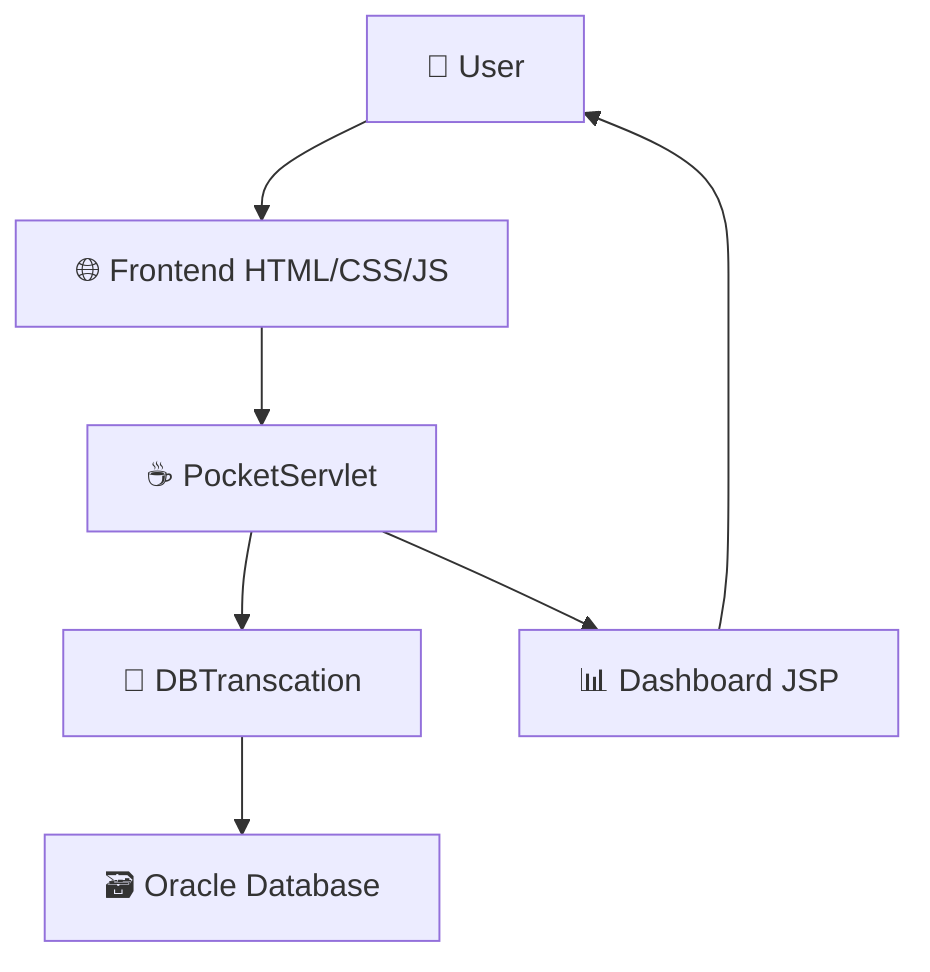

# 💰 PocketMoney Web Application

<div align="center">
  
```

	 ┌─────────────────────────────────────────────┐
	 │                                             │
	 │        💳 P O C K E T M O N E Y 💳         │
	 │                                             │
	 │     📊 Take Control of Your Finances 📊    │
	 │                                             │
	 └─────────────────────────────────────────────┘

```


**A modern, responsive web application for personal expense tracking and financial management**

[✨ Features](#features) • [🚀 Quick Start](#quick-start) • [📁 Project Structure](#project-structure) • [🛠️ Installation](#installation) • [📱 Usage](#usage)

**Developed by Amrit Raj Singh**

</div>

---

## 🌟 Features

### 💡 **Modern Design**
- **Glassmorphism UI**: Beautiful frosted glass effects with backdrop blur
- **Responsive Layout**: Seamlessly adapts to desktop, tablet, and mobile devices
- **Animated Interactions**: Smooth hover effects and transitions for enhanced UX
- **Contemporary Gradients**: Eye-catching blue gradient backgrounds

### 🔐 **User Authentication**
- **Secure Registration**: Email validation and password confirmation
- **Login System**: Username/password authentication with session management
- **Password Visibility Toggle**: User-friendly password input with show/hide functionality
- **Real-time Validation**: Instant feedback for form inputs

### 📊 **Financial Tracking**
- **Dashboard Overview**: Quick stats and expense summaries
- **Expense Management**: Track and categorize your spending
- **Visual Analytics**: Charts and graphs for expense visualization
- **Category Organization**: Organize expenses by different categories

### 🎨 **User Experience**
- **Intuitive Navigation**: Clean sidebar navigation with active states
- **Loading Animations**: Smooth fade-in effects for better perceived performance
- **Error Handling**: User-friendly error messages and validation
- **Accessibility**: Semantic HTML and proper contrast ratios

---

## 🚀 Quick Start

### Prerequisites
- ☕ **Java 11+** (Jakarta EE support)
- 🗃️ **Oracle Database** (XE or higher)
- 🌐 **Web Server** (Tomcat 10+)
- 💻 **Modern Web Browser**

### 🛠️ Installation

1. **Clone the Repository**
	```bash
	git clone https://github.com/Amrit114/pocket-money.git
	cd pocket-money
	```

2. **Database Setup**
	```sql
	-- Connect to Oracle Database and create the table
	CREATE TABLE pocketusers (
		 uname VARCHAR2(50) PRIMARY KEY,
		 email VARCHAR2(100) NOT NULL,
		 upass VARCHAR2(100) NOT NULL
	);
	```

3. **Configure Database Connection**
	```java
	// Update DBCon.java with your Oracle database credentials
	con = DriverManager.getConnection(
		 "jdbc:oracle:thin:@localhost:1521:xe", 
		 "system", 
		 "system"
	);
	```

4. **Deploy to Server**
	- Copy all files to your web server's webapp directory
	- Ensure the servlet container supports Jakarta EE
	- Start your web server

5. **Access the Application**
	```
	🌐 http://localhost:8080/pocketmoney/homepage.html
	```

---

## 📁 Project Structure

```
PocketMoney/
├── homepage.html          # Landing page with hero section
├── signin.html            # User login interface
├── signup.html            # User registration form
├── style.css              # Dashboard and global styles
├── Money/
│   ├── PocketServlet.java # Main servlet controller
│   ├── DBCon.java         # Database connection utility
│   ├── DBTranscation.java # Database operations
│   └── RegData.java       # User data model
└── dashboard.jsp          # Main application dashboard
```

### 🏗️ Architecture Overview



---

## 📱 Usage

### 🎯 **Getting Started**

1. **Registration**: Create your account with username, email, and secure password
2. **Login**: Access your dashboard with your credentials
3. **Dashboard**: View your financial overview and statistics
4. **Track Expenses**: Add and categorize your daily expenses
5. **Analyze**: Review your spending patterns with visual charts

### 🖥️ **Navigation**

- **🏠 Home**: Landing page with application overview
- **📊 Dashboard**: Main expense tracking interface
- **📝 Add Expense**: Record new financial transactions
- **📈 Analytics**: Visual reports and spending insights
- **⚙️ Settings**: Account and preference management
- **🚪 Logout**: Secure session termination

---

## 🎨 Design Philosophy

### 🌈 **Color Palette**
```css
Primary Gradient:   linear-gradient(135deg, #4facfe, #00f2fe)
Glass Background:   rgba(255, 255, 255, 0.1)
Text Primary:       #ffffff
Text Secondary:     rgba(255, 255, 255, 0.8)
Accent:            #0072ff
```

### 🖼️ **Visual Elements**
- **Glassmorphism**: Semi-transparent backgrounds with blur effects
- **Smooth Animations**: CSS transitions for interactive elements
- **Modern Typography**: Poppins font family for clean readability
- **Responsive Grid**: CSS Grid and Flexbox for layout management

---

## 🔧 Technical Specifications

### **Frontend Technologies**
- **HTML5**: Semantic markup with accessibility features
- **CSS3**: Modern styling with Grid, Flexbox, and animations
- **JavaScript**: Form validation and interactive elements
- **Font Awesome**: Icon library for visual consistency

### **Backend Technologies**
- **Java**: Server-side logic with Jakarta EE
- **Oracle Database**: Reliable data persistence
- **JDBC**: Database connectivity and operations
- **Servlets**: HTTP request handling and routing

---

## 🤝 Contributing

We welcome contributions! Please follow these steps:

1. **Fork** the repository
2. **Create** a feature branch (`git checkout -b feature/AmazingFeature`)
3. **Commit** your changes (`git commit -m 'Add some AmazingFeature'`)
4. **Push** to the branch (`git push origin feature/AmazingFeature`)
5. **Open** a Pull Request

### 📋 **Contribution Guidelines**
- Follow existing code style and conventions
- Add comments for complex logic
- Test your changes thoroughly
- Update documentation as needed

---

## 📄 License

This project is licensed under the **MIT License** - see the [LICENSE.md](LICENSE.md) file for details.

---

## 📞 Support & Contact

<div align="center">

**Need Help?** 🤔

📧 **Email**: singhamritraj898@gmail.com  
🐛 **Issues**: [GitHub Issues](https://github.com/Amrit114/pocket-money/issues)  
📖 **Documentation**: [Wiki](https://github.com/Amrit114/pocket-money/wiki)

---

### 🌟 **Made with ❤️ by Amrit Raj Singh**

```____            _        _   __  __                        
|  _ \ ___   ___| | _____| |_|  \/  | ___  _ __   ___ _   _ 
| |_) / _ \ / __| |/ / _ \ __| |\/| |/ _ \| '_ \ / _ \ | | |
|  __/ (_) | (__|   <  __/ |_| |  | | (_) | | | |  __/ |_| |
|_|   \___/ \___|_|\_\___|\__|_|  |_|\___/|_| |_|\___|\__, |
                                                     |___/
```

**🚀 Empowering Financial Freedom, One Transaction at a Time**

</div>
